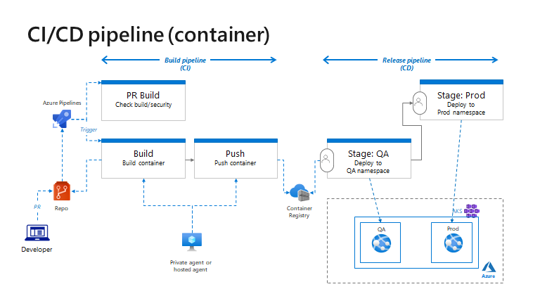

# Sample code for DevOps HoL (Container)



## Local build & test

Build and run a container in local environment.

```
docker build -t webapp:1 -f Dockerfile .

docker run --name webapp --rm -p 8080:80 -d webapp:1
```

### ACR build

Build a container using ACR and push to your repository.

```
az acr build -r ikjcontainer.azurecr.io -f Dockerfile --build-arg BUILDID=1 -t <youracr>.azurecr.io/webapp:1  -t <youracr>.azurecr.io/webapp:latest .

docker run --name webapp --rm -p 8081:80 -d <youracr>.azurecr.io/webapp:1
```

## Pipelines

Create a build and release pipeline in Azure DevOps. See [sample pipelines](./pipelines)

## AKS deployment & troubleshooting

Create a secret in your namespace before deploy to AKS.

```
kubectl create secret docker-registry regsecret \
--docker-server=<youracr>.azurecr.io \
--docker-username=<youracr> \
--docker-password=<password> \
--namespace qa
```

Command to Get IP of the service and others

```
kubectl get svc -n qa

kubectl describe pod <podname> -n qa
```

## References

- Containerize a .NET app
    - https://docs.microsoft.com/en-us/dotnet/core/docker/build-container

- Azure DevOps (yaml)
    - yaml schema: https://docs.microsoft.com/en-us/azure/devops/pipelines/yaml-schema/?view=azure-pipelines
    - pipeline task: https://docs.microsoft.com/en-us/azure/devops/pipelines/tasks/?view=azure-devops
    - K8s manifest task: https://docs.microsoft.com/en-us/azure/devops/pipelines/tasks/deploy/kubernetes-manifest?view=azure-devops
    - pre-defiend variables: https://docs.microsoft.com/en-us/azure/devops/pipelines/build/variables